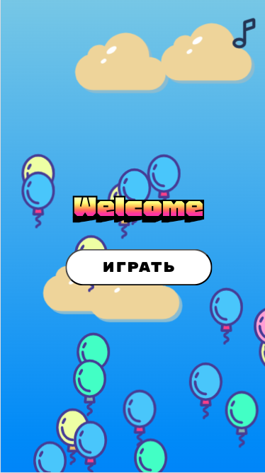
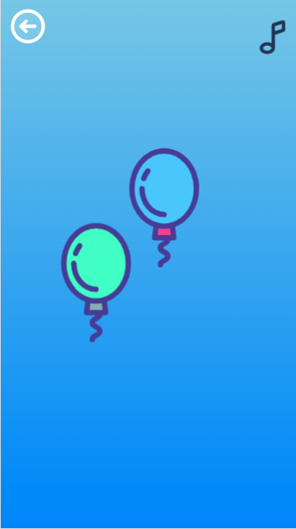

# Игра Шарики

**Шарики** - это увлекательная и простая игра для малышей, в которой игроки могут лопать шарики, развивая свои моторные навыки и координацию. Игра основана на динамичном взаимодействии и помогает детям учиться через игру.

## Содержание

- [Демо](#демо)
- [Технологии](#технологии)
- [Установка](#установка)
- [Использование](#использование)


## Демо

https://kids-game-balloon.vercel.app/

- **Главная страница:**
  

- **Начало игры:**
  

## Технологии

Этот проект разработан с использованием следующих технологий:

- [React](https://reactjs.org/)
- [TypeScript](https://www.typescriptlang.org/)
- [Howler.js](https://howlerjs.com/)
- [Lodash](https://lodash.com/)
- [SCSS](https://sass-lang.com/)

## Установка

Чтобы запустить проект локально, выполните следующие шаги:

1. Клонируйте репозиторий:

   ```bash
    git clone https://github.com/SvetlanaZinovkina/kids-game-balloon
    cd kids-game-balloon
    npm install
    npm start
    ```

## Использование
 - Нажмите на шарики, чтобы лопнуть их!
